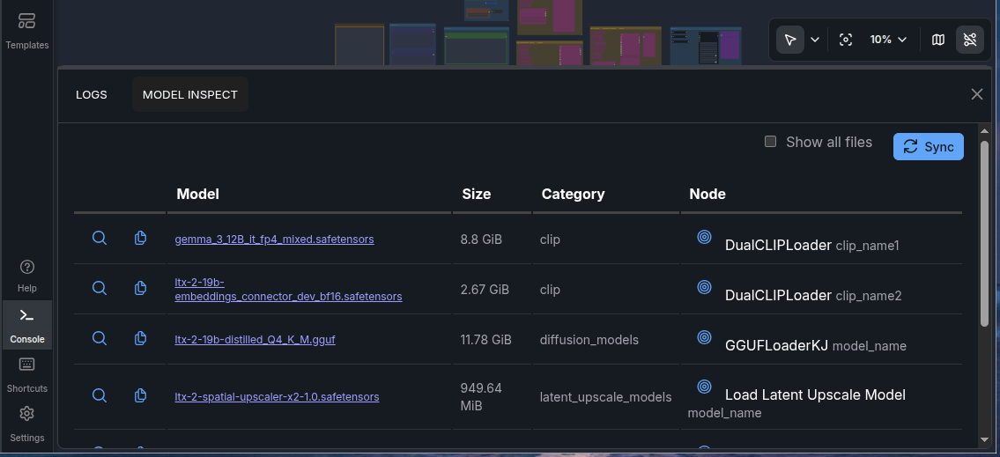

# ComfyUI-ModelInspect

https://github.com/idlesign/ComfyUI-ModelInspect

Facilitates model files audit and search

## Features

* List models file names for nodes.
* Show both missing and available locally files.
* Find the node using a file in the workflow.
* Quick file search with Google.
* Links to the exact files (if such are provided in hint nodes of the workflow).

## Installation

### Automated

Use [ComfyUI-Manager](https://github.com/Comfy-Org/ComfyUI-Manager/) to install `ComfyUI-ModelInspect`.

### Manual

1. Step into `ComfyUI/custom_nodes` directory
2. `git clone https://github.com/idlesign/ComfyUI-ModelInspect`
3. Restart ComfyUI

## Typical usage example

* Download and load a workflow.
* Open `Console` (the button is at the bottom of the left menu).
* Switch to `MODEL INSPECT` tab.
* Press `Sync` button.
* In the list locate files missing from your filesystem.
* Find the files and download (you may use `Category` hint to choose the right directory to download into).
* Pressing `Sync` button also refreshes model dropdown lists in nodes.
